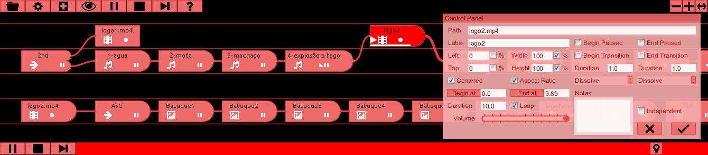

# Backstage

#### License [GPL-3+](LICENSE)

Some [Videos](https://www.youtube.com/channel/UCQ6gAS_r49hooE0dBdEfLDw).

if you find bugs, go to [github](https://github.com/linux-man/backstage/issues).

if you have questions, try [forums.softlab.pt](http://forums.softlab.pt).

Binaries at [Releases](https://github.com/linux-man/backstage/releases).

This program was born from the tiredness of using Powerpoint/Media player/Quicktime/VLC/Image viewer/whatever... to manage music, image and video projection.

You use a Control Panel on the primary display and do the projection at the secondary.

The Control Panel IS NOT a timeline. It's a media manager where you organize and connect the different media - the Nodes.

There are 6 types:

Link , Text  and Rect  are created using the menu.

To add Image , Audio  and Video  you can also drag and drop the wanted files (not working on FX2D Renderer).

Initially you have 4 tracks. It's important to understand that at each time only one node can be active (playing) on each track.

This can be annoying but is also usefull. One example:

You want to do a slideshow with music. Drop a audio file on the first (bottom) track, then drop your 100 images on another track (leave the audio track free). The hard part is to connect all images, one after another.

To start the music at the first image, create a Link node, put it before the audio. It's the start node. Connect it to the audio and to the first image.

Open the audio properties. Choose loop.

How to stop the audio after the last image? Just connect the last image to another link node and put it on the first track. When the link "starts" the audio is stopped. If nothing is playing the show ends. If you want to stop at the end of the music, do the opposite. If you want a never ending slideshow, connect the last image to the first.

Select the first Link node. Press play.

### Interface

Move nodes: Left click + drag

Move around: Left click + drag on empty space

Select several nodes: Control + Left click

Connect nodes: Right click + drag & drop (maximum of 4 connections from node)

Delete connection: Right click over the connection semi-circle

Delete node: Right click

Duplicate node: Control + Right click

Open node properties window: Double click.

Resize window: drag resize button at top-right

Add/remove tracks: plus/minus buttons

There are 2 sets of PLAY/PAUSE, STEP and STOP buttons. The upper is the GLOBAL player. It starts all the SELECTED nodes. It pauses all the PLAYING nodes. Same goes for the STEP and STOP buttons.

The bottom buttons (NODE buttons) only affect the last selected node. This way you can start or stop playing something during the show. The STEP button ends a playing node and jumps to the next connected nodes.

At the "Gear" submenu you can compress your project to export to other computer, change the default duration of new Text, Rect and Image nodes (default is 5 seconds) and change theme.

The "Eye" turn fullscreen on/off. You can't do that while playing.

Nodes with "Loop": it's expected to use STEP to move forward.

STEP always respects End Paused and End Transition.

An "Independent" node is not controlled by the global buttons (except the STOP button which stops everything). You must start/pause/step selecting it and using the NODE buttons. Also you can only play an Independent node if other non-independent nodes are already playing. You can't start a show with an Independent node.

### Keyboard Shortcuts

Ctrl+A: Select All

Ctrl+LEFT: Select All at left of Cursor

Ctrl+RIGHT: Select All at right of Cursor

SPACE: Play/Pause (Global)

RIGHT: Step (Global)

ENTER: Stop (Global)

P: Jumps to a Playing Node

Shift+SPACE: Play/Pause (Last Selected Node)

Shift+RIGHT: Step (Last Selected Node)

Shift+ENTER: Stop (Last Selected Node)

### Accepted formats

Image: jpg, png, gif, bmp.

Audio: wav, mp3, au, aiff, ogg, wma, asf, mka, tta, dts, mp2, a52, aac, flac, ra.

Video: avi, mp4, mov, ogv, mkv, 3gp, wmv, flv, ts, mpeg, rm, dv, vid.

### Requirements

Java JRE 17

VLC Media Player 3.x or later

### New on 3.0

There are 3 files - DEFAULT, P2D and FX2D (FX2D Library must be installed) - that must be commented/uncommented (at line 18) to change the renderer. The presentation window start fullscreen at the secondary monitor (if present) and can be windowed.

New Nodes:
- Gallery  - shows a folder of images
- Random  - randomly selects one of the connected nodes to continue
- Exec  call and terminate a Process. Need to use absolute path (probably needs some adjustments)

Backstage will auto-start if called with a parameter (stage file path), like "backstage ~/presentation.stage"

### Issues

Drag n' Drop is disable on FX2D renderer.
If you install Backstage you can open a project by double clicking the file. On Windows, a console window is opened. You can close it. That happens because Processing apps must be run on their working directories. I couldn't find a registry key to force that, so I had to open a command line and run Backstage after a "change dir". If someone knows how to avoid this please tell me. UPDATE: currently, the installer is not compiled.

On Linux, Java has a tendency to crash when a monitor is connected/disconnected. Looks like a long time [bug](https://www.google.pt/search?q=sun.awt.image.BufImgSurfaceData+cannot+be+cast+to+sun.java2d.xr.XRSurfaceData).

Sometimes at start the theme is not correctly applied.

Sometimes, when loading a video/audio the sound keeps playing. Just stop it.

During the limited tests I did on Mac, I found that the original Opengl version crash, so I added an alternative DEFAULT (JAVA2D) version.

### Acknowledgements

[Processing](https://processing.org/)

[G4P](http://www.lagers.org.uk/g4p/)

[VLCJVideo](https://github.com/linux-man/VLCJVideo)

[vlcj](https://github.com/caprica/vlcj)

[Drop](http://transfluxus.github.io/drop/)

Image buttons from [Fontawesome](http://fontawesome.io/)

Stage icon from [Findicons](http://findicons.com)

Control panel icon from [Iconarchive](http://www.iconarchive.com)

